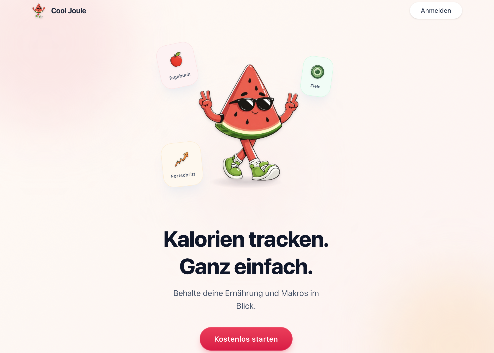
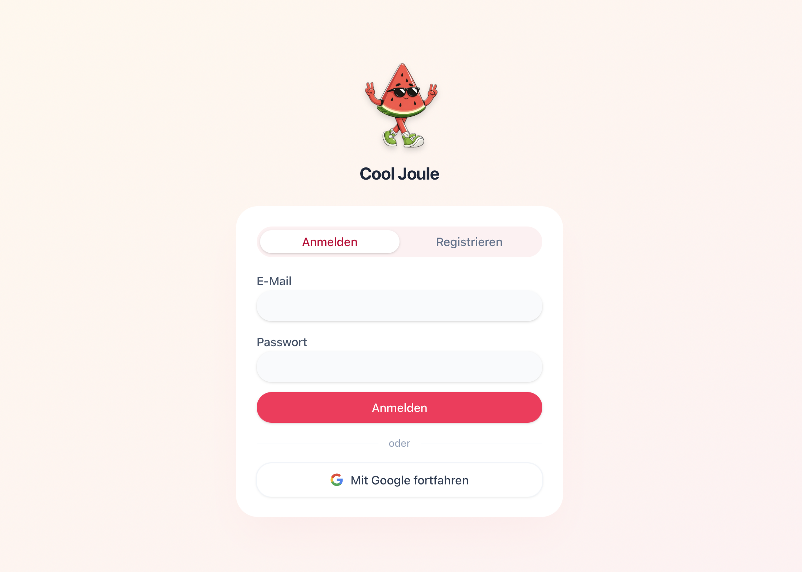
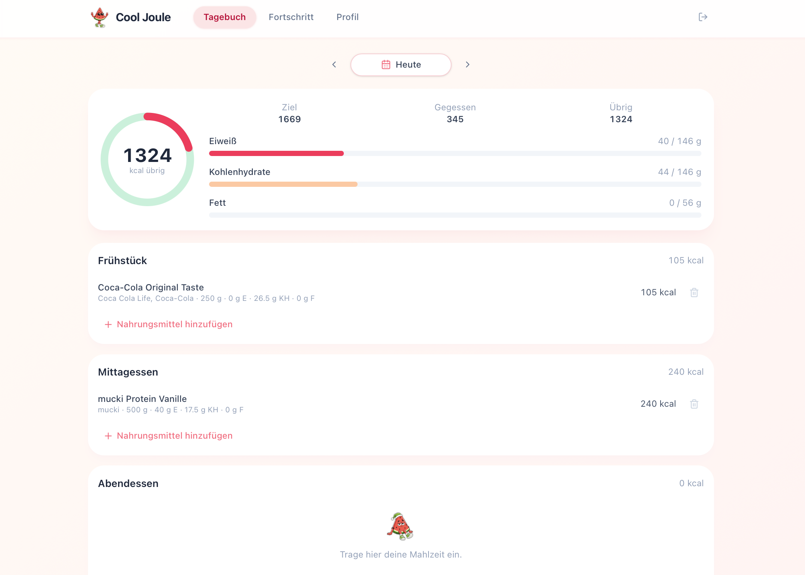
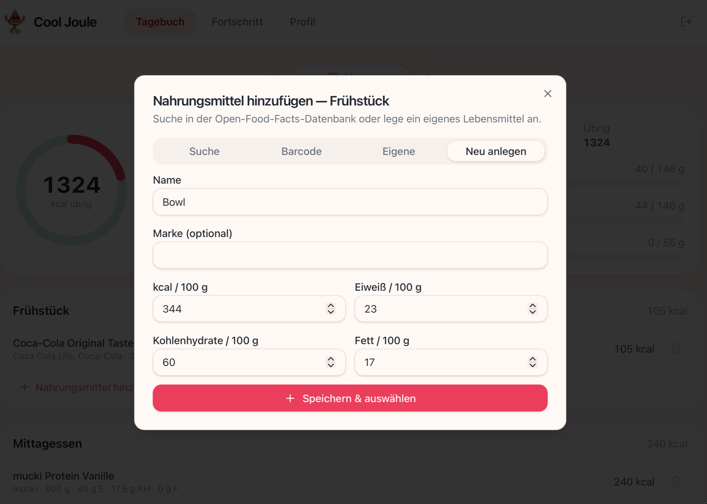
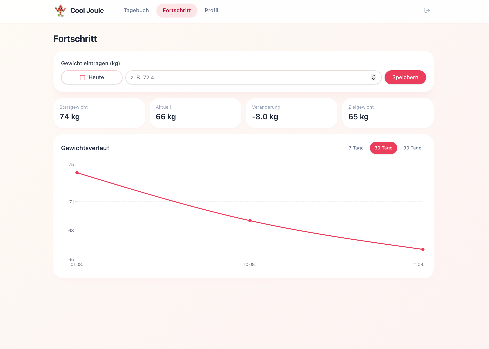
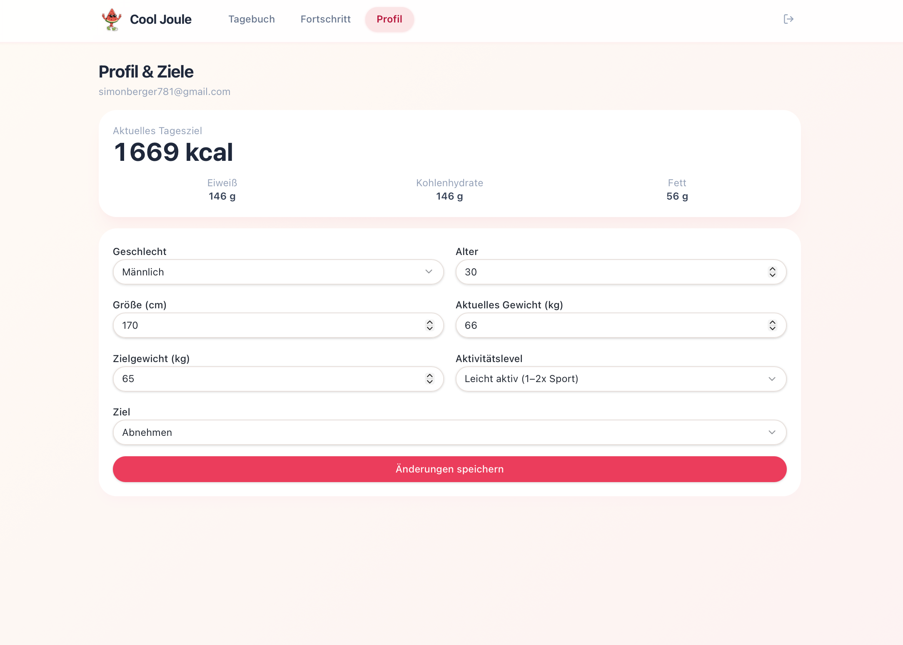

# Cool Joule

Deutschsprachiges Ernährungstagebuch zum Tracken von Kalorien, Makros und Gewicht — inspiriert von MyFitnessPal, gebaut als Full-Stack-Portfolio-Projekt.

<p align="left">
  <a href="https://github.com/Simons-Github/cool-joule/actions/workflows/ci.yml">
    
  </a>
  
  
  <a href="./LICENSE">
    
  </a>
</p>

🚀 **Live Demo:** [cool-joule.vercel.app](https://cool-joule.vercel.app)  
📦 **Repository:** [github.com/Simons-Github/cool-joule](https://github.com/Simons-Github/cool-joule/)

---

## Screenshots

| Landing | Login |
| :-----: | :---: |
|  |  |
| Hero & Auth | E-Mail / Passwort & Google |

| Tagebuch | Lebensmittel hinzufügen |
| :------: | :---------------------: |
|  |  |
| Kalorien, Makros & Mahlzeiten | Suche, Barcode & eigene Foods |

| Fortschritt | Profil |
| :---------: | :----: |
|  |  |
| Gewichtsverlauf & Stats | Ziele & Körperdaten |

---

## Über das Projekt

**Cool Joule** hilft dabei, Mahlzeiten zu erfassen, Tagesziele für Kalorien und Makros im Blick zu behalten und den Gewichtsverlauf über Zeit zu verfolgen.

Beim ersten Login berechnet ein Onboarding-Wizard (Mifflin-St Jeor) individuelle Kalorien- und Makroziele. Lebensmittel lassen sich per Textsuche oder Barcode aus der **Open Food Facts**-Datenbank importieren, fotografieren (KI-Schätzung) oder als eigene Einträge anlegen.

### Highlights

- Authentifizierung via **Supabase** (E-Mail/Passwort + Google OAuth, Passwort-Reset)
- Tages-Tagebuch mit Datumsnavigation und Makro-Übersicht
- Lebensmittel-Suche und Barcode-Lookup (Server Functions) plus Kamera-Scan
- KI-Fotoanalyse (Gemini) — eigener API-Key im Profil; App-Key nur für Allowlist-Accounts (5/24h)
- Gewichtstracking mit Recharts-Diagramm (7 / 30 / 90 Tage)
- Mobile-first Layout
- Row Level Security — Nutzer sehen nur eigene Daten
- Datenexport und Konto löschen
- Unit-Tests (Vitest) und GitHub Actions CI (`lint`, `test`, `build`)

---

## Tech Stack

| Bereich | Technologie |
| ------- | ----------- |
| Frontend | React 19, TypeScript, TanStack Router/Start/Query |
| Styling | Tailwind CSS 4, shadcn/ui, Lucide |
| Charts | Recharts |
| Backend | Supabase (PostgreSQL, Auth, RLS) + TanStack Start Server Functions |
| KI | Google Gemini (User-Key oder Owner-App-Key / AI Gateway) |
| Externe API | Open Food Facts |
| Tooling | Vite, Vitest, ESLint, Prettier |
| CI | GitHub Actions |
| Hosting | Vercel |

---

## Architektur

```
Browser (React)
    ├── Supabase JS Client     →  Auth + PostgreSQL (RLS)
    └── Server Functions       →  Fotoanalyse, Quota, User-Gemini-Keys,
                                  OFF-Suche/Barcode, Konto löschen
```

TDEE-Berechnung und Tagebuch-CRUD laufen im Client gegen Supabase (RLS). Kostenpflichtige oder geheime Operationen (Gemini, Secret-Key, Open-Food-Facts-User-Agent) laufen in Server Functions. JWT wird per `Authorization: Bearer` angehängt und serverseitig mit `auth.getUser` geprüft.

---

## Features im Detail

| Feature | Status |
| ------- | ------ |
| Login / Registrierung (E-Mail, Google) | ✅ |
| Passwort zurücksetzen | ✅ |
| Multi-Step-Onboarding mit TDEE & Makros | ✅ |
| Tagebuch (Frühstück, Mittag, Abend, Snacks) | ✅ |
| Open Food Facts Textsuche | ✅ |
| Barcode-Lookup + Kamera-Scan | ✅ |
| KI-Fotoanalyse | ✅ |
| Eigene Lebensmittel anlegen | ✅ |
| Gewichtsverlauf & Chart | ✅ |
| Profil & Ziele bearbeiten | ✅ |
| Datenexport / Konto löschen | ✅ |
| Exercise-Kalorien im Tagebuch | ⏳ Geplant |

---

## Lokale Entwicklung

**Voraussetzungen:** Node.js 20+, npm, Supabase-Projekt

```sh
git clone https://github.com/Simons-Github/cool-joule.git
cd cool-joule
cp .env.example .env
npm install
npm run dev
```

`.env` aus [`.env.example`](.env.example) befüllen. Mindestens:

```env
VITE_SUPABASE_URL=https://<project-id>.supabase.co
VITE_SUPABASE_PUBLISHABLE_KEY=<publishable-key>
```

Für Fotoanalyse, verschlüsselte User-Keys und Konto-Löschen zusätzlich (ohne `VITE_`-Prefix):

```env
SUPABASE_SECRET_KEY=<secret-key>
USER_SECRETS_ENCRYPTION_KEY=<32-byte-base64>
GEMINI_API_KEY=<optional>
AI_GATEWAY_API_KEY=<optional>
FOOD_PHOTO_USE_AI_GATEWAY=   # nur "true", wenn OIDC-Gateway bewusst genutzt wird
FOOD_PHOTO_APP_KEY_USER_IDS=<deine-user-uuid>
FOOD_PHOTO_APP_KEY_EMAILS=<deine-login-email>
```

`process.env.VERCEL` allein gilt **nicht** als Gateway-Auth. Ohne Eintrag in der Allowlist brauchen Nutzer einen eigenen Gemini-Key im Profil. Leere Allowlists sind fail-closed (niemand bekommt den App-Key). Allowlist-Accounts ohne eigenen Key haben 5 Analysen / 24 Stunden.

### Supabase einrichten

1. Migrationen anwenden (`supabase/migrations/`) oder per Supabase CLI deployen
2. **Authentication → Providers → Google** aktivieren (optional)
3. **Authentication → Providers → Email:** [Leaked password protection](https://supabase.com/docs/guides/auth/password-security#password-strength-and-leaked-password-protection) einschalten
4. **URL Configuration:** Redirect-URLs setzen (Login, OAuth, Passwort-Recovery):
   - `http://localhost:5173/auth`
   - `https://<production-domain>/auth`

### Scripts

| Befehl | Beschreibung |
| ------- | ----------- |
| `npm run dev` | Dev-Server starten |
| `npm test` | Vitest Unit-Tests |
| `npm run lint` | ESLint + Prettier |
| `npm run build` | Production-Build |

---

## Datenbank

| Tabelle | Zweck |
| ------- | ----- |
| `profiles` | Körperdaten, Ziele, Makros, Onboarding-Status |
| `food_logs` | Tägliche Mahlzeit-Einträge |
| `weight_logs` | Gewicht pro Tag |
| `custom_foods` | Nutzerdefinierte Lebensmittel |
| `user_gemini_keys` | Verschlüsselte User-Gemini-Keys (nur service_role) |
| `food_photo_server_usage` | 5/24h-Quota für den App-Key (Allowlist, nur service_role) |
| `server_rate_limits` | Rate-Limits für Server Functions (nur service_role) |

Nutzerdaten-Tabellen haben **Row Level Security** (`auth.uid()` = eigener Datensatz). Key-/Quota-/Rate-Limit-Tabellen sind dem Client entzogen.

---

## CI

Bei Push und Pull Request auf `main` läuft [GitHub Actions](.github/workflows/ci.yml):

`lint` → `test` → `build`

---

## Projektstruktur

```
src/
├── routes/           # TanStack Router (Seiten)
├── components/       # UI & Feature-Komponenten
├── lib/              # nutrition, OFF, Fotoanalyse, Auth-Helfer
├── integrations/     # Supabase Client, Admin-Client & Types
└── hooks/            # Profile, Barcode-Scanner, …
supabase/migrations/  # SQL-Schema + RLS
```

---

## Deployment

Die App wird über Vercel unter [cool-joule.vercel.app](https://cool-joule.vercel.app) gehostet.

### Production-Checkliste

- [ ] Dieselben `VITE_SUPABASE_*`-Werte wie im Supabase-Projekt
- [ ] `SUPABASE_SECRET_KEY` und `USER_SECRETS_ENCRYPTION_KEY` in Vercel (Production **und** Preview)
- [ ] `GEMINI_API_KEY` und/oder `AI_GATEWAY_API_KEY` (oder `FOOD_PHOTO_USE_AI_GATEWAY=true` bei bewusst aktiviertem OIDC-Gateway)
- [ ] `FOOD_PHOTO_APP_KEY_USER_IDS` / `FOOD_PHOTO_APP_KEY_EMAILS` auf die Allowlist-Accounts
- [ ] Auth-Redirects inkl. `/auth` für Recovery
- [ ] Leaked-Password-Protection im Supabase-Dashboard
- [ ] Migrationen auf dem Cool-Joule-Projekt angewendet

---

## Lizenz & Autor

MIT © 2026 **[Simon Berger](https://github.com/Simons-Github)** — portfolio project.
